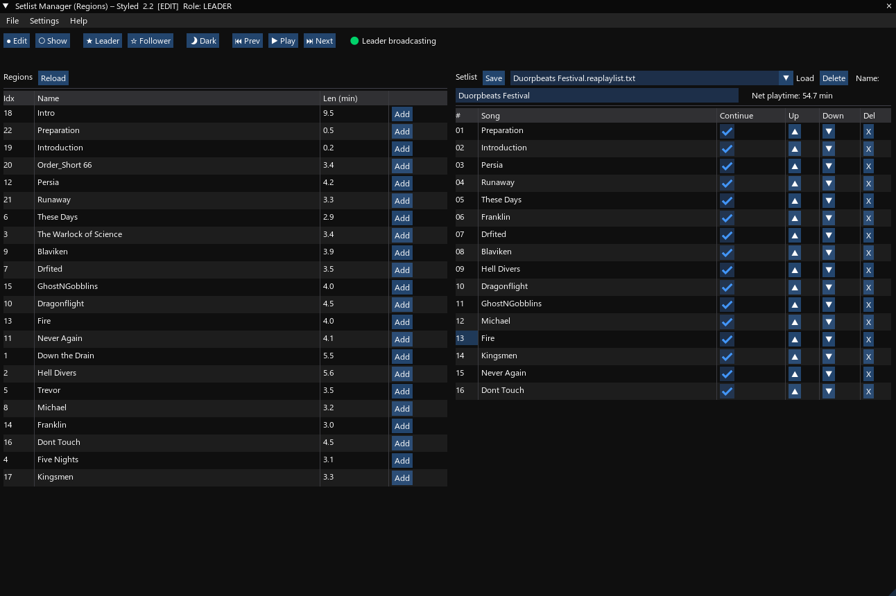
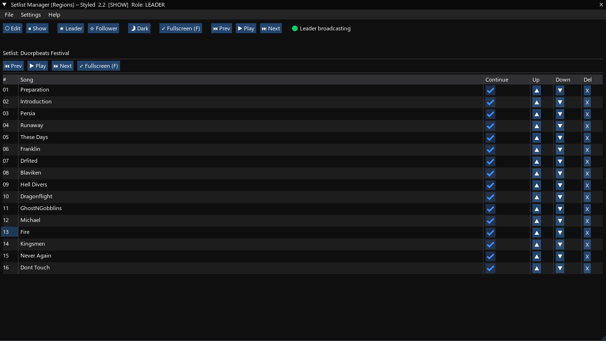
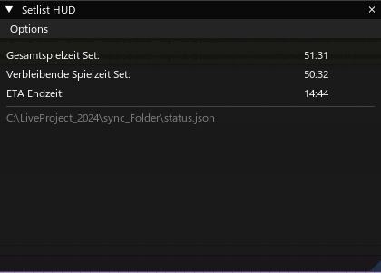

***For English version scroll down***

# REAPER Live Show Setlist Controller

Ein Lua-Script-Bundle für **REAPER**, das Setlists für Live-Shows verwaltet, Songs steuert (*Play, Pause, Next, Prev*) und ein separates **HUD/Uhr-Fenster** mit **Gesamtspielzeit**, **Restspielzeit** und **ETA Endzeit (Uhrzeit)** bereitstellt.

Es gibt zwei Hauptmodi im Hauptscript:

- **Edit-Modus** – Erstellen, Bearbeiten und Anordnen der Setlist.  
  

- **Show-Modus** – Große Anzeige für Live-Performances mit direkter Steuerung.  
  

Zusätzliches, separates HUD:

- **Setlist HUD (Uhr)** – Großes, skalierbares Infofenster mit Gesamt/Rest/ETA.  
  

> ⚠️ **Wichtiger Hinweis**: Einsatz **auf eigene Gefahr**. Vor Live-Shows unbedingt ausführlich testen.

---

## Features

- **Setlist-Verwaltung**
  - Regions scannen, Songs hinzufügen, umsortieren, entfernen
  - Setlists als `*.reaplaylist.txt` speichern & laden
  - *Repair by name*: fehlende Region-IDs anhand der Namen wiederherstellen
- **Show-Modus**
  - Große, gut lesbare Ansicht; Windowed/Vollbild
  - Steuerbuttons: *Prev* / *Play/Pause* / *Next*
  - Schreibgeschützt (kein versehentliches Editieren im Show-Modus)
- **Leader/Follower**
  - Dateibasierte Sync über **gemeinsame `status.json`** (Netzwerkfreigabe)
  - Follower übernimmt Index/Play/Pause automatisch
  - Breiter Diagnose-Tooltip (Alter, Latenz, Pfad, Leader-Status)
- **HUD / Uhr (separates Script)**
  - Zeigt **Gesamt**, **Rest**, **ETA (HH:MM)**
  - **Auto-Fit**: Schrift passt sich dem Fenster an (umschaltbar)
  - Manueller Scale via Slider oder `Ctrl` + `+`/`-`
- **Design & UX**
  - Light/Dark-Theme, UI-Scale (Hauptscript)
  - Robuste Pfadbehandlung (Windows/macOS), Datei/Ordner-Dialoge (JS-API)
  - Persistente Settings (inkl. Fullscreen-State und HUD-Scale)

---

## Enthaltene Skripte

- `Setlist_Manager_Regions_ImGui_Styled.lua` – **Hauptscript** (Edit/Show, Leader/Follower, schreibt `status.json`)
- `Setlist_HUD_Status.lua` – **HUD/Uhr** (liest `status.json`, zeigt Zeiten/ETA)
- `Start_Setlist_And_HUD.lua` *(optional)* – **Launcher**, der beide Actions startet (Action-IDs eintragen)

---

## Voraussetzungen

### Erforderlich
- **REAPER 6.x+**
- **ReaImGui** (via **ReaPack** installieren; REAPER danach neu starten)

### Optional (empfohlen)
- **SWS Extension** (z. B. für `CF_ShellExecute`) – <https://www.sws-extension.org/>
- **JS_ReaScript API** (native Datei-/Ordner-Dialoge)

---

## Installation

1. Repo/Dateien herunterladen.
2. In REAPER: `Actions → Show Action List → Load...` und die `.lua`-Dateien laden.
3. *(Optional)* Toolbar-Button anlegen: `View → Toolbars` → Rechtsklick → `Add action…`.

---

## Erster Start & Einrichtung

1. **Hauptscript** starten.  
2. Menü **Settings**:
   - **Setlist folder** wählen/erstellen (Speicherort für `*.reaplaylist.txt`)
   - **Status path (shared)** auf eine **gemeinsame** `status.json` (Netzwerkfreigabe) setzen
   - **Apply** → **Save Settings**
3. **HUD** starten (`Setlist_HUD_Status.lua`) – liest dieselbe `status.json`.  
   Im HUD unter **Options**: *Auto-Fit to window* ein/aus, sonst Scale-Slider nutzen.
4. *(Optional)* **Launcher**: In `Start_Setlist_And_HUD.lua` die beiden **Action-IDs** eintragen  
   (in der Action-Liste: Rechtsklick → *Copy selected action command ID*). Danach startet ein Klick beide Skripte.

---

## Leader/Follower-Setup (Dateibasiert)

- **Leader**: Rolle *Leader* aktivieren, Status-Pfad auf **gemeinsame** `status.json` setzen → Script schreibt periodisch (Index/Status/Zeit).  
- **Follower**: Rolle *Follower* aktivieren, **denselben** `status.json`-Pfad setzen → Script liest periodisch und folgt.  
- Hover über „Leader active / In Sync“ zeigt breiten Tooltip (Alter, Latenz, Pfad, Leader-Infos).

> Kein direkter TCP-Socket – die gemeinsame Datei auf einem **erreichbaren, beschreibbaren** Share ist die Quelle der Wahrheit.

---

## Verwendung

### Edit-Modus
- Regions **Reload** → per **Add** in die Setlist übernehmen  
- Reihenfolge per **▲ / ▼**, **Continue** toggeln, **X** löscht  
- **Save** speichert als `*.reaplaylist.txt`

### Show-Modus
- Große Anzeige, **Prev / Play/Pause / Next**, **F** für Vollbild  
- UI ist **read-only** (keine unabsichtlichen Änderungen)

### HUD / Uhr
- Zeigt **Gesamt**, **Rest**, **ETA**  
- **Auto-Fit** skaliert Schrift zur Fenstergröße; sonst manueller Scale/Hotkeys

---

## Tastenkürzel (Hauptscript)

- **Space** – Play/Pause  
- **N** – Next  **P** – Prev  
- **E** – Edit  **H** – Show  
- **F** – Fullscreen (nur Show)  
- **1** – Leader **2** – Follower  

**HUD:** `Ctrl` + `+` / `-` (wenn Auto-Fit aus)

---

## Tipps für Live

- **Smooth Seeking** aktivieren: `Options → Smooth seek (on bar/beat change)`  
- **Auto-Scroll** im Arrange ggf. deaktivieren  
- **Zweitmonitor** für Show/HUD verwenden  
- **Netzfreigabe testen** (Rechte/Latenz), bevor es auf die Bühne geht

---

## Troubleshooting

- **HUD zeigt nichts / „status.json nicht gefunden“**  
  → Pfad im **Hauptscript** & **HUD** identisch? Share erreichbar? Schreibrechte vorhanden?

- **Follower hinkt hinterher**  
  → Langsame Freigabe? Intervall ist großzügig, aber bei sehr trägen Shares hilft schnellere Ablage (lokal + Sync-Dienst).

- **Falsche Restzeit/ETA**  
  → Region-Start/Ende prüfen, *Continue*-Flags korrekt?

---

## Changelog

### 2.3
- **Persistenz erweitert**: Fullscreen-State & weitere Settings werden zuverlässig gespeichert/geladen  
- **Pfad-Handling**: Windows/macOS-sichere Normalisierung & `path_join`, UNC-Fixes  
- **Robustes JSON**: Flat-Encoder/Parser, sauberes Escaping (inkl. `\u002C` für Kommata)  
- **SHOW-Modus read-only**: Buttons/Checkboxen im Show-Panel sind deaktiviert  
- **Regionen-Ende**: Stabilere Enderkennung (`pos >= fin - EPS`)  
- **Sync-Toleranzen**: WRITE/POLL-Intervalle & EPS für Netzfreigaben großzügiger gewählt  
- **UX/Diagnose**: Breiter Tooltip mit sauberem Wrap; Leader/Follower-Status detaillierter  
- **HUD-Integration**: Hauptscript schreibt zusätzlich `total_sec`, `remaining_sec`, `eta_epoch` in `status.json`  
- **Neues HUD-Script** (`Setlist_HUD_Status.lua`): Auto-Fit, manueller Scale, Pfad-Anzeige, Theme-Follow  
- **Starter-Script** (optional): Startet Hauptscript + HUD in einem Rutsch  
- **Settings-Apply-Flow**: Eingabepuffer, „Apply“ übernimmt Pfade/Namen ohne Zurückspringen

### 2.2
- Fixes: Pfad-Persistenz & Windows-Root, Auto-Save  
- Diverse Stabilitäts- und UI-Verbesserungen

### 2.1
- Erste „Styled“-Variante mit Light/Dark, Fullscreen, Hilfe, UI-Scale, A/B-Sync-Grundlage

---

## Lizenz

MIT-Lizenz – freie Nutzung, Veränderung und Weitergabe erlaubt.

---

# English Version

# REAPER Live Show Setlist Controller

A Lua script bundle for **REAPER** to manage live setlists, control songs (*Play, Pause, Next, Prev*), and provide a separate **HUD/clock** window showing **Total**, **Remaining**, and **ETA** (clock time).

Main script modes:

- **Edit Mode** – Create, edit, arrange the setlist.  
  

- **Show Mode** – Large live-friendly display with direct controls.  
  

Optional separate HUD:

- **Setlist HUD (clock)** – Large, scalable info view with total/remaining/ETA.  
  

> ⚠️ **Use at your own risk.** Test thoroughly before going on stage.

---

## Features

- **Setlist management**: scan regions, add/reorder/remove, save/load `*.reaplaylist.txt`, name-based repair  
- **Show Mode**: big display, Windowed/Fullscreen, play controls, **read-only** UI  
- **Leader/Follower** via **file-based** sync using a shared **`status.json`**  
- **HUD/Clock**: Auto-Fit to window, manual scale, theme-aware, shows path  
- **Polished UX**: Light/Dark theme, UI scale, robust cross-platform paths, persistent settings

---

## Included

- `Setlist_Manager_Regions_ImGui_Styled.lua` – main script (writes `status.json`)  
- `Setlist_HUD_Status.lua` – HUD/clock (reads `status.json`)  
- `Start_Setlist_And_HUD.lua` – optional launcher (put your action IDs)

---

## Requirements

- **REAPER 6.x+**  
- **ReaImGui** via **ReaPack** (install, then restart REAPER)

Optional: **SWS Extension**, **JS_ReaScript API**

---

## Setup (Quick)

1. Run the **main script** → **Settings**: set **Setlist folder** and shared **Status path** → **Apply** / **Save**  
2. Run the **HUD** (reads the same `status.json`) → Auto-Fit or manual scale  
3. *(Optional)* Use the **Launcher** to start both with one click

---

## Hotkeys (main script)

Space = Play/Pause • N = Next • P = Prev • E = Edit • H = Show • F = Fullscreen (Show) • 1 = Leader • 2 = Follower  
**HUD:** `Ctrl` + `+` / `-` (if Auto-Fit is off)

---

## Changelog

See the German section above for detailed changes.

---

## License

MIT License.
