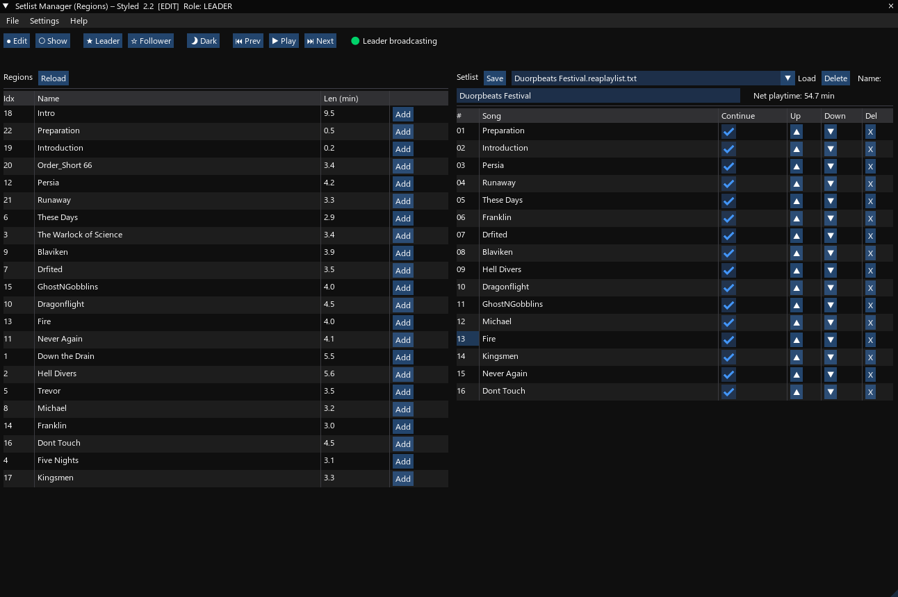
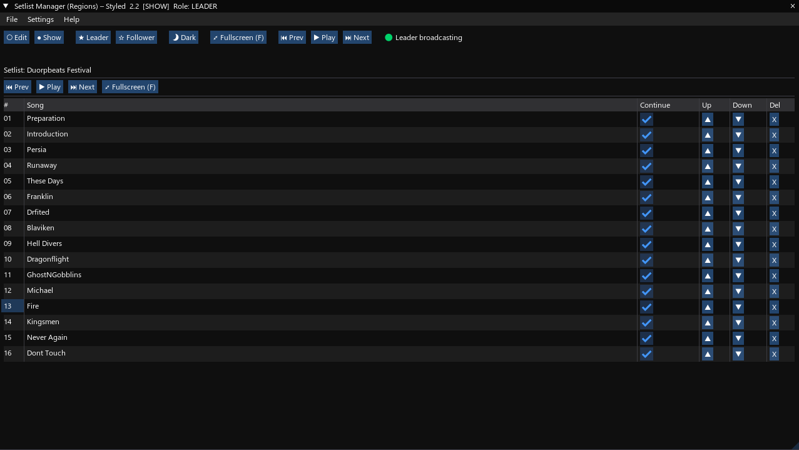
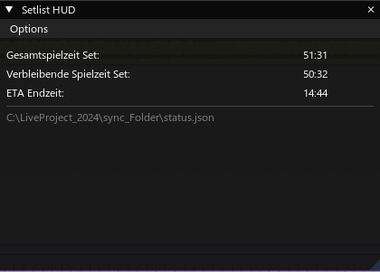

***For English version scroll down***

# REAPER Live Show Setlist Controller

Ein Lua-Script-Bundle für **REAPER**, das Setlists für Live-Shows verwaltet, Songs steuert (*Play, Stop, Next, Prev*) und ein separates **HUD/Uhr-Fenster** mit **Gesamtspielzeit**, **Restspielzeit** und **ETA Endzeit (Uhrzeit)** bereitstellt.

Es gibt zwei Hauptmodi im Hauptscript:

- **Edit-Modus** – Erstellen, Bearbeiten und Anordnen der Setlist.  
  

- **Show-Modus** – Große Anzeige für Live-Performances mit direkter Steuerung.  
  

Zusätzliches, separates HUD:

- **Setlist HUD (Uhr)** – Großes, skalierbares Infofenster mit Gesamt/Rest/ETA.  
  

> ⚠️ **Wichtiger Hinweis**: Einsatz **auf eigene Gefahr**. Vor Live-Shows unbedingt ausführlich testen.

---

## Features

- **Setlist-Verwaltung**
  - Regions scannen, Songs hinzufügen, umsortieren, entfernen
  - Setlists als `*.reaplaylist.txt` speichern & laden
  - *Repair by name*: fehlende Region-IDs anhand der Namen wiederherstellen
- **Show-Modus**
  - Große, gut lesbare Ansicht; Windowed/Vollbild
  - Steuerbuttons: *Prev* / *Play* / *Stop* / *Next* mit Resume-Fähigkeit
  - Schreibgeschützt (kein versehentliches Editieren im Show-Modus)
- **Dateibasierte Konfiguration & Sync**
  - Lokale Einstellungen (UI Scale, Theme) pro Rechner über `setlist_config.json`
  - Playlisten und `status.json` (für das HUD) im Skript-Ordner (perfekt für Cloud-Sync)
- **HUD / Uhr (separates Script)**
  - Zeigt **Gesamt**, **Rest**, **ETA (HH:MM)**
  - **Neu: Fullscreen Modus (F)** für maximale Bühnentauglichkeit (NOW, NEXT, ETA)
  - **Auto-Fit**: Schrift passt sich dem Fenster an (umschaltbar)
  - Manueller Scale via Slider oder `Ctrl` + `+`/`-`
- **Design & UX**
  - Light/Dark-Theme, UI-Scale (Hauptscript)
  - Robuste Pfadbehandlung (Windows/macOS/Linux), Datei/Ordner-Dialoge (JS-API)

---

## Enthaltene Skripte

- `Setlist_Manager_Regions_ImGui_Styled.lua` – **Hauptscript** (Edit/Show, schreibt `status.json`)
- `Setlist_HUD_Status.lua` – **HUD/Uhr** (liest `status.json`, zeigt Zeiten/ETA)
- `Start_Setlist_And_HUD.lua` *(optional)* – **Launcher**, der beide Actions startet (Action-IDs eintragen)

---

## Voraussetzungen

### Erforderlich
- **REAPER 6.x+**
- **ReaImGui** (via **ReaPack** installieren; REAPER danach neu starten)

### Optional (empfohlen)
- **SWS Extension** (z. B. für `CF_ShellExecute`) – <https://www.sws-extension.org/>
- **JS_ReaScript API** (native Datei-/Ordner-Dialoge)

---

## Installation

1. Repo/Dateien herunterladen.
2. In REAPER: `Actions → Show Action List → Load...` und die `.lua`-Dateien laden.
3. *(Optional)* Toolbar-Button anlegen: `View → Toolbars` → Rechtsklick → `Add action…`.

---

## Erster Start & Einrichtung

1. **Hauptscript** starten.  
2. Menü **Settings**:
   - **Setlist folder** wählen/erstellen (Speicherort für `*.reaplaylist.txt`)
   - **HUD output file** auf einen gemeinsamen Pfad (z.B. im Skript-Ordner) setzen
   - **Apply** → **Save Settings**
3. **HUD** starten (`Setlist_HUD_Status.lua`) – liest automatisch dieselbe `status.json`.  
   Im HUD unter **Options**: *Auto-Fit to window* ein/aus, sonst Scale-Slider nutzen.
4. *(Optional)* **Launcher**: In `Start_Setlist_And_HUD.lua` die beiden **Action-IDs** eintragen  
   (in der Action-Liste: Rechtsklick → *Copy selected action command ID*). Danach startet ein Klick beide Skripte.

---

## Sync & Backup-Setup

- Den Skript-Ordner einfach über Syncthing, Dropbox oder Nextcloud auf den Zweitrechner spiegeln.
- Die Konfiguration (Scale, Theme, Fensterstatus) bleibt dank lokaler `setlist_config.json` im jeweiligen OS-Appdata-Verzeichnis pro Laptop individuell.
- Alle Setlists (`*.reaplaylist.txt`) und die `status.json` werden nahtlos synchronisiert, da sie im Skriptordner verbleiben.
- Für absolutes, synchrones Live-Playback wird empfohlen, **Timecode (LTC/MTC)** vom Leader zum Follower-Rechner zu senden.

---

## Verwendung

### Edit-Modus
- Regions **Reload** → per **Add** in die Setlist übernehmen  
- Reihenfolge per **▲ / ▼**, **Continue** toggeln, **X** löscht  
- **Save** speichert als `*.reaplaylist.txt`

### Show-Modus
- Große Anzeige, **Prev / Play / Stop / Next**, **F** für Vollbild  
- UI ist **read-only** (keine unabsichtlichen Änderungen)

### HUD / Uhr
- Zeigt **Gesamt**, **Rest**, **ETA**  
- **Vollbild (F)**: Riesige Anzeige des laufenden und nächsten Songs sowie der Endzeit.
- **Auto-Fit** skaliert Schrift zur Fenstergröße; sonst manueller Scale/Hotkeys

---

## Tastenkürzel (Hauptscript)

- **Space** – Play/Stop (mit echtem Resume!)
- **N** – Next  **P** – Prev  
- **E** – Edit  **H** – Show  
- **F** – Fullscreen (nur Show)  

**HUD:** `F` für Vollbild, `Ctrl` + `+` / `-` für Zoom (wenn Auto-Fit aus)

---

## Tipps für Live

- **Smooth Seeking** aktivieren: `Options → Smooth seek (on bar/beat change)`  
- **Auto-Scroll** im Arrange ggf. deaktivieren  
- **Zweitmonitor** für Show/HUD verwenden  
- **Hardware-Controller** (z.B. Streamdeck) für Play/Stop konfigurieren.

---

## Troubleshooting

- **HUD zeigt nichts / „status.json nicht gefunden“**  
  → Wurde das Hauptscript gestartet? Ist der HUD output file Pfad korrekt?

- **Falsche Restzeit/ETA**  
  → Region-Start/Ende prüfen, *Continue*-Flags korrekt?

---

## Changelog

### 2.5
- **Ausfallsicherheit für Live (Fail-Safes)**: Crash-Schutz (`pcall`) in allen Hauptschleifen, lag-resistentes Region-Skipping und atomare `status.json` Writes.
- **HUD Toleranz**: HUD verzeiht nun kurze Lese-/Netzwerkaussetzer (3 Sekunden Grace-Period).
- **HUD Vollbild**: Taste `F` (oder Menü) wechselt in eine gigantische Ansicht, die *Laufenden Song*, *Nächsten Song* und *ETA* anzeigt.

### 2.4
- **Entfernung von Leader/Follower**: Fokus auf robusten Standalone-Betrieb & Cloud-Sync
- **Play/Stop getrennt**: Echte Resume-Funktionalität integriert
- **Lokale Config**: `setlist_config.json` liegt OS-spezifisch ab, um individuelle UI-Scales pro Laptop zu garantieren
- **Bugfixes**: Auto-Advance Cursor-Korrektur und Next-Button Limitierung behoben

### 2.3
- **Persistenz erweitert**: Fullscreen-State & weitere Settings
- **Pfad-Handling**: Windows/macOS-sichere Normalisierung & UNC-Fixes  
- **Neues HUD-Script** (`Setlist_HUD_Status.lua`): Auto-Fit, Theme-Follow  

### 2.2
- Fixes: Pfad-Persistenz & Windows-Root, Auto-Save  

### 2.1
- Erste „Styled“-Variante mit Light/Dark, Fullscreen, Hilfe, UI-Scale

---

## Lizenz

MIT-Lizenz – freie Nutzung, Veränderung und Weitergabe erlaubt.

---

# English Version

# REAPER Live Show Setlist Controller

A Lua script bundle for **REAPER** to manage live setlists, control songs (*Play, Stop, Next, Prev*), and provide a separate **HUD/clock** window showing **Total**, **Remaining**, and **ETA** (clock time).

Main script modes:

- **Edit Mode** – Create, edit, arrange the setlist.  
  

- **Show Mode** – Large live-friendly display with direct controls.  
  

Optional separate HUD:

- **Setlist HUD (clock)** – Large, scalable info view with total/remaining/ETA.  
  

> ⚠️ **Use at your own risk.** Test thoroughly before going on stage.

---

## Features

- **Setlist management**: scan regions, add/reorder/remove, save/load `*.reaplaylist.txt`, name-based repair  
- **Show Mode**: big display, Windowed/Fullscreen, play controls with precise resume, **read-only** UI  
- **Cloud-Ready Sync**: Local UI configs per machine, while setlists and status files sync perfectly via Syncthing/Dropbox.
- **HUD/Clock**: Auto-Fit to window, manual scale, theme-aware, shows path. Features a giant **Fullscreen Mode** (`F`) showing current song, next song and ETA.
- **Polished UX**: Light/Dark theme, UI scale, robust cross-platform paths, persistent settings

---

## Included

- `Setlist_Manager_Regions_ImGui_Styled.lua` – main script (writes `status.json`)  
- `Setlist_HUD_Status.lua` – HUD/clock (reads `status.json`)  
- `Start_Setlist_And_HUD.lua` – optional launcher (put your action IDs)

---

## Requirements

- **REAPER 6.x+**  
- **ReaImGui** via **ReaPack** (install, then restart REAPER)

Optional: **SWS Extension**, **JS_ReaScript API**

---

## Setup (Quick)

1. Run the **main script** → **Settings**: set **Setlist folder** and **HUD output file** → **Apply** / **Save**  
2. Run the **HUD** (reads the same `status.json`) → Auto-Fit or manual scale  
3. *(Optional)* Use the **Launcher** to start both with one click

---

## Hotkeys (main script)

Space = Play/Stop • N = Next • P = Prev • E = Edit • H = Show • F = Fullscreen (Show) 
**HUD:** `F` = Fullscreen • `Ctrl` + `+` / `-` (if Auto-Fit is off)

---

## Changelog

See the German section above for detailed changes up to v2.5.

---

## License

MIT License.
